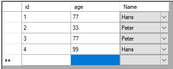

This repo shows how to use a combobox column in a databound datatable.



## How To

Let's say we have a schema like this:

```SQL
CREATE TABLE Person (Id INTEGER PRIMARY KEY, Name TEXT, Age INTEGER);
```

The `Name` Column should be represented as a comboboxcolum in the grid.

First you have to delte the autogenerated column:

```C#
dataGridView1.Columns.Remove("Name");
```

Next, you have to create your own Combobox column:

```C#
var comboboxColum = new DataGridViewComboBoxColumn();
comboboxColum.Items.AddRange("Hans", "Peter");
comboboxColum.DataPropertyName = "Name";
comboboxColum.HeaderText = "Name";

dataGridView1.Columns.Add(comboboxColum);
```

Note that in `AddRange` you could select a list of stored values from the database. 
Be aware that the combobox is not editable by default. Making it editable probably requires a bit of work.
A bugged proof of concept approach is described [here](https://bettereducation.com.au/forum/it.aspx?g=posts&t=1905). Be aware that this approach throws errors and additional work is required.

## Full Example Code

```C#
public Form1()
{
    InitializeComponent();


    var query = "SELECT * FROM PERSON";
    table = new DataTable();
    using (var connection = new SQLiteConnection("Data Source=db.sqlite"))
    using (var adapter = new SQLiteDataAdapter(query, connection))
    {
        adapter.Fill(table);
    }

    dataGridView1.DataSource = table;
    dataGridView1.Columns.Remove("Name");

    var comboboxColum = new DataGridViewComboBoxColumn();
    comboboxColum.Items.AddRange("Hans", "Peter");
    comboboxColum.DataPropertyName = "Name";
    comboboxColum.HeaderText = "Name";

    dataGridView1.Columns.Add(comboboxColum);
}
```